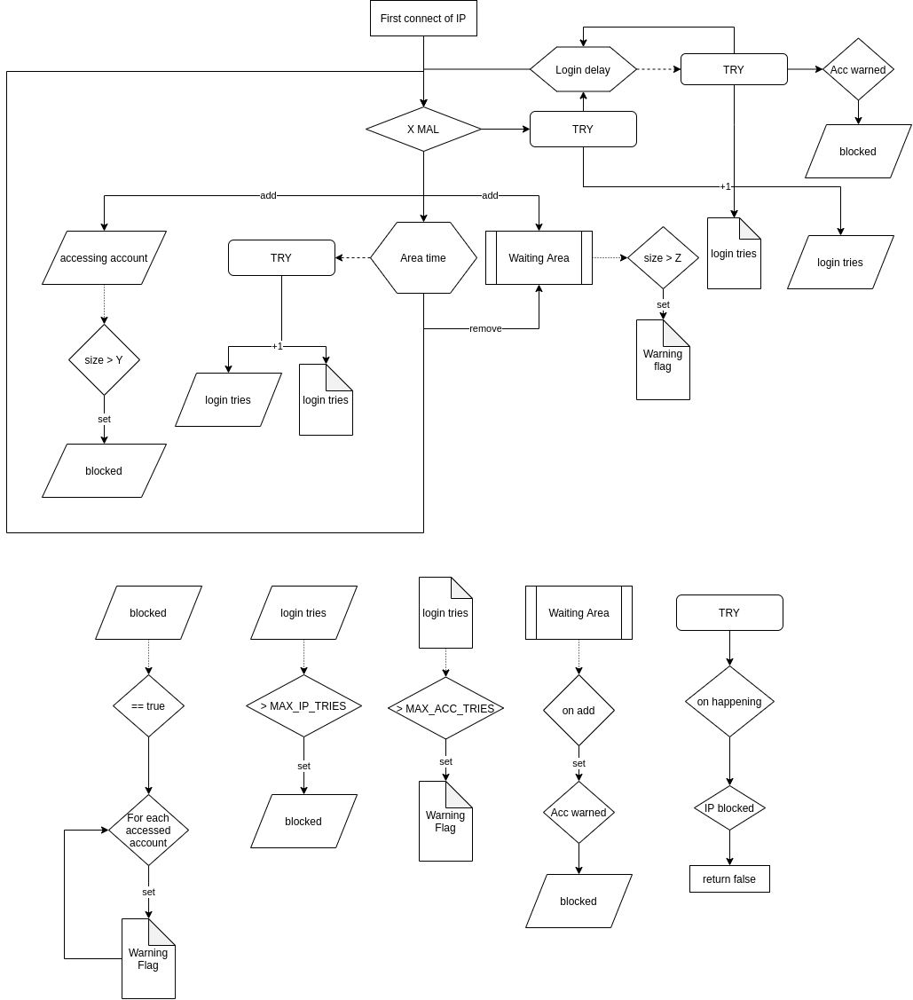
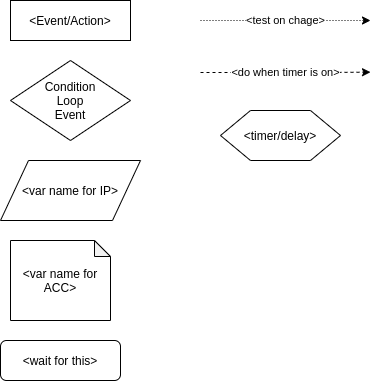

# login-secure

[](https://github.com/{{repo}}/issues?q=is%3Aopen+is%3Aissue+label%3Abug)
[](https://github.com/{{repo}}/issues?q=is%3Aclosed+is%3Aissue+label%3Abug)

[](https://github.com/{{repo}}/releases/latest)

[](github.com/{{repo}}/releases)


<br>

This lib provides ....

### Development


<br>

[](https://codeclimate.com/github/{{repo}})
[](https://codeclimate.com/github/{{repo}})
[](https://codeclimate.com/github/{{repo}})

### Usage


[](https://niton.jfrog.io/ui/repos/tree/General/java-libs%2Fcom%2Fniton%2F{{name}})

#### Gradle

```groovy
repositories {
    maven {
        url("https://niton.jfrog.io/artifactory/java-libs/")
    }
}
```

This is an API that streamlines login in a very secure system.
This system includes reporting of accounts which are in danger due to an attack.

## Flow
The process of the login handling is visualized here as it is kind of complex

> The lower part of the image visualizes "listeners"

Here is the matching legend
